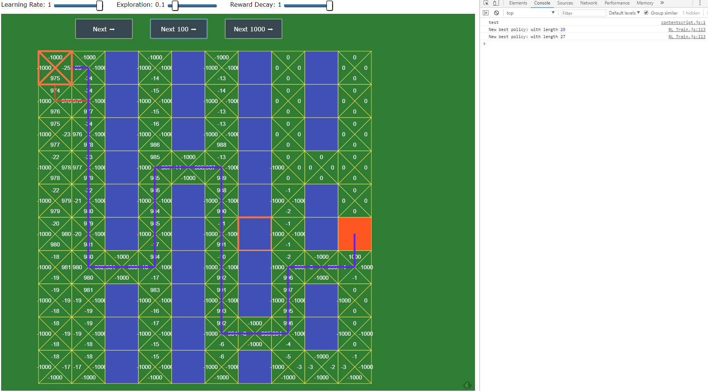

#Reinforcement Learning:

##Q-Networks. An introduction: Wandering through a maze
This is an attempt to explore a simple example of a q-network.

### 1. Introduction

The application is a simple grid. Each grid keeps track of its own state and q-values. It is not aware of the environment, boundaries and obstacles.

It learns that through interaction (rewards) with the environment.
